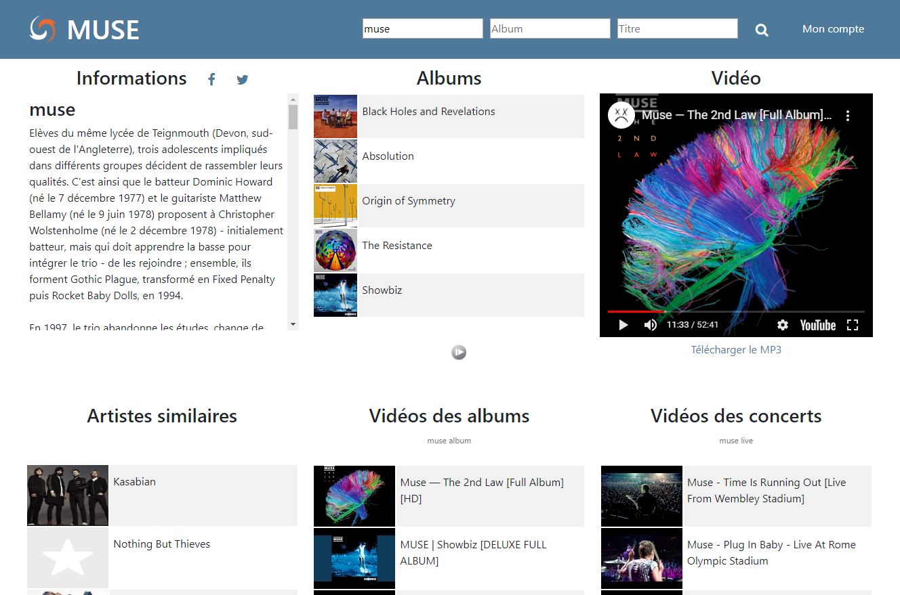

# music
A web interface, to discover new music.
Mashup lastfm / youtube with Laravel

#screenshots

# config
Google Service Account need to store in config/t412-174617-2943404bd220.json 
LastFM API in config/lastfm 
The others settings in config/app and .env

#Spotify
You can have links to open albums on Spotify if you create app on Spotify and set your keys in .env file