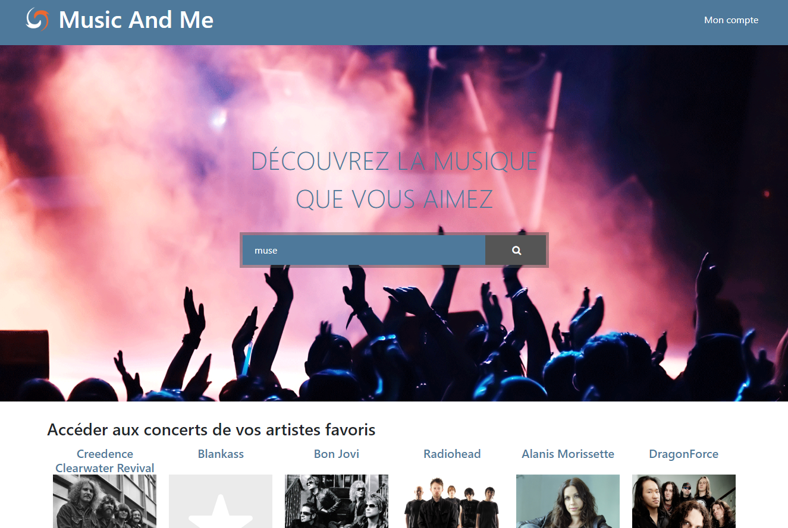
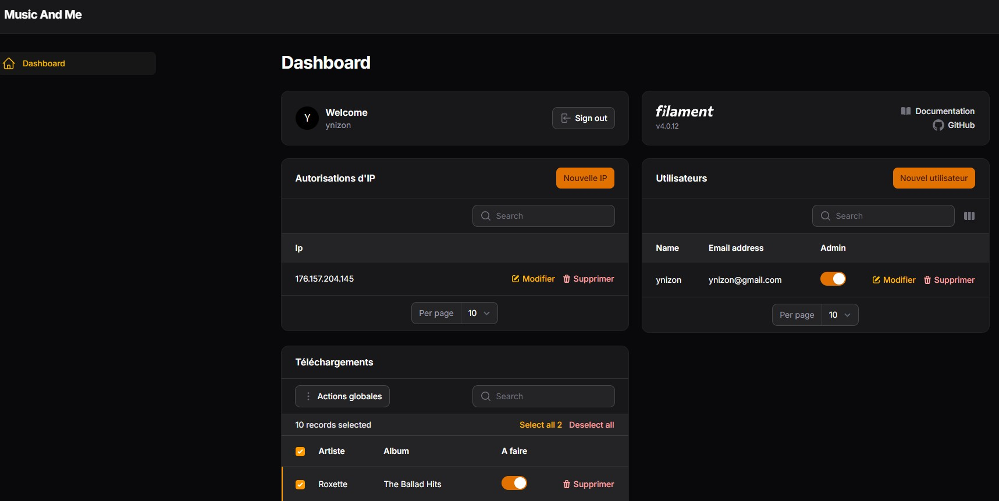

## Goal
A web interface, to discover and listen new music artists.
It's a mashup website with lastfm / youtube with Laravel / PHP 8.2.

## Screenshots
Front:


Back:


## Installation

``` git clone git@github.com:ynizon/music.git
cd music
cp .env.example .env (update .env with your conf)
composer install
php artisan key:generate
php artisan migrate --seed
```

## Spotify Link (open and download)
Create your app on Spotify and set your api keys in the .env file
With this, you can :
- have links to open albums on Spotify on the front.
- If you have a <a href="https://github.com/spotDL/spotify-downloader">spotdl docker</a>, 
you can connect this app to lidarr, and automatize download from monitored artist.
If it detects new albums, you can see them in /spotdl . Check them to download.
